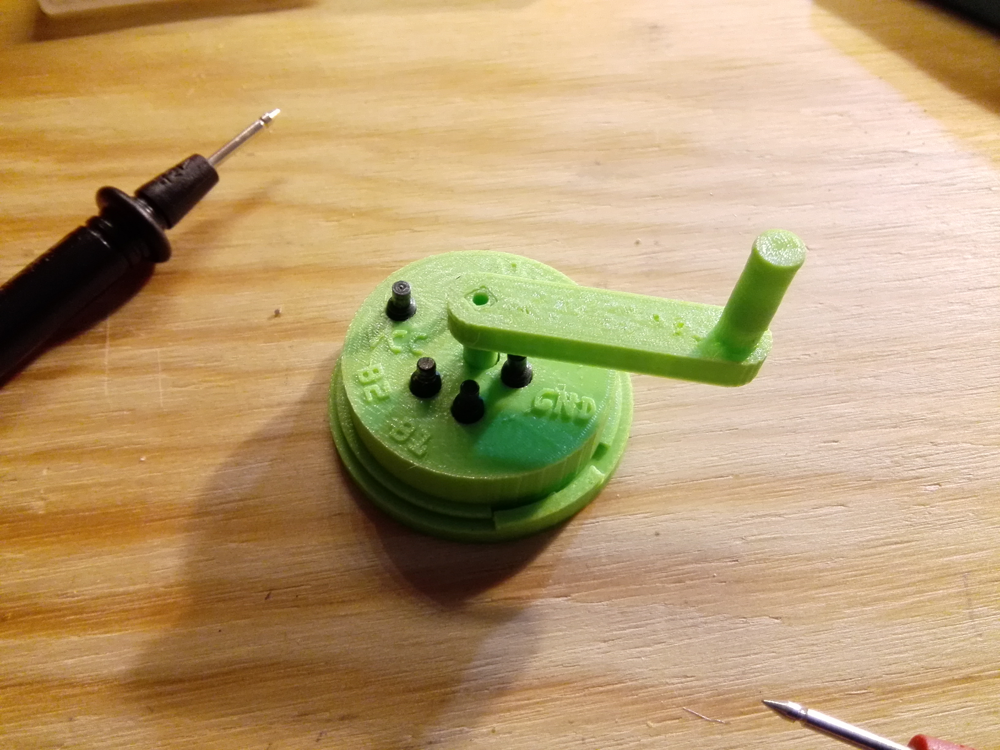
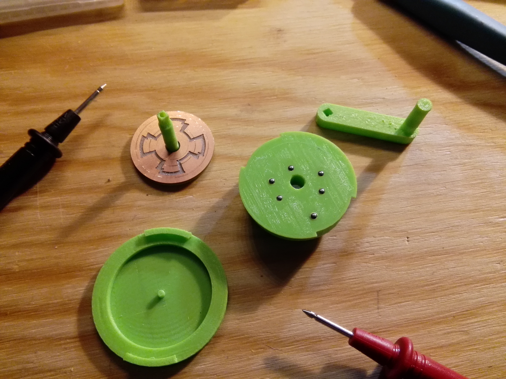

##  ASD - Analoger Stepper Driver  ##

Der analoge Stepper Driver dient dazu einen Stepper Motor ohne Microcontroller zu bewegen.... analog durch Drehung.

... aus der Serie: braucht kein Mensch, wollte ich aber unbedingt bauen.

# Design #

3D Design mit Google SketchUP. Platinendesign mit Inkscape.

# Produktion #

3D Druck auf einem Craftbot.

Platinenfräsung mit einer Othermill

Endmontage im www.erfindergarden.de

# Funktion #

Über die Kugelkontakte werden die beiden Spulen des Steppermotors mit der Platine verbunden. Folgendes Schema wird dabei verwendet:

 

Die Äußere Bahn hat Kontakt zum Ground der Stromquelle und die innere Bahn hat Kontakt zum VCC. Zwischen diesen beiden dauerhaft kontaktierten Bahnen verläuft die Abtastung. Abwechselnd GND - Isolierabstand (rot) - VCC.

